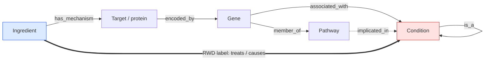

# Bridge

Predict, for a drug–condition pair with no real-world data, whether the drug is likely to
**treat** the condition or **cause** it, using biology (targets, genes, pathways, disease
hierarchy) as the bridge between drugs that have real-world evidence and drugs that do not.



Solid edges are inputs. The bold edge is the label, learned from pairs that have real-world
evidence and predicted for pairs that do not.

## Data in this repo

| file | rows | content |
|---|---|---|
| `data/cem_ingredients.csv` | 4,276 | RxNorm ingredients with at least one CEM association (concept id, name) |
| `data/cem_ingredient_condition_associations.csv` | 1,447,172 | One row per ingredient–condition pair with FAERS disproportionality stats, EU label counts, and SemMedDB relationship types. Source: OHDSI Common Evidence Model, `cem_output.cem_unified`. Not committed (115 MB, over GitHub's file limit); regenerate with the query below. |

Both files are restricted to RxNorm `Ingredient` concepts on the drug side and standard
`Condition`-domain concepts on the outcome side.

## Current task

1. Build condition-side features for the 5,631 conditions: implicated genes and pathways
   (Open Targets, Reactome), OMOP/SNOMED hierarchy position, phenotype profile.
2. Build drug-side features: ChEMBL mechanisms and targets.
3. Fit an explicit path-feature baseline (gradient boosting) before any GNN.
4. Evaluate with drugs held out entirely, never by random pair split.

See [DESIGN.md](DESIGN.md) for the full rationale and known data limitations.

## Regenerating the association file

Requires the local Postgres `cem` database.

```bash
psql -d cem -c "\copy (select u.concept_id_1 as ingredient_concept_id, c1.concept_name as ingredient_name, u.concept_id_2 as condition_concept_id, c2.concept_name as condition_name, bool_or(u.source_id='aeolus') as in_faers, bool_or(u.source_id='eu_pl_adr') as in_eu_label, bool_or(u.source_id='semmeddb') as in_semmeddb, max(u.statistic_value) filter (where u.source_id='aeolus' and u.evidence_type='COUNT') as faers_case_count, max(u.statistic_value) filter (where u.source_id='aeolus' and u.evidence_type='PRR') as faers_prr, max(u.statistic_value) filter (where u.source_id='aeolus' and u.evidence_type='ROR') as faers_ror, max(u.statistic_value) filter (where u.source_id='aeolus' and u.evidence_type='CHI_SQUARE') as faers_chi_square, max(u.statistic_value) filter (where u.source_id='eu_pl_adr') as eu_label_count, string_agg(distinct u.relationship_id||'='||u.statistic_value::int, ';') filter (where u.source_id='semmeddb') as semmeddb_relationships from cem_output.cem_unified u join staging_vocabulary.concept c1 on c1.concept_id=u.concept_id_1 join staging_vocabulary.concept c2 on c2.concept_id=u.concept_id_2 where c1.concept_class_id='Ingredient' and c2.domain_id='Condition' and c2.standard_concept='S' group by 1,2,3,4 order by 2,4) to 'data/cem_ingredient_condition_associations.csv' csv header"
```
